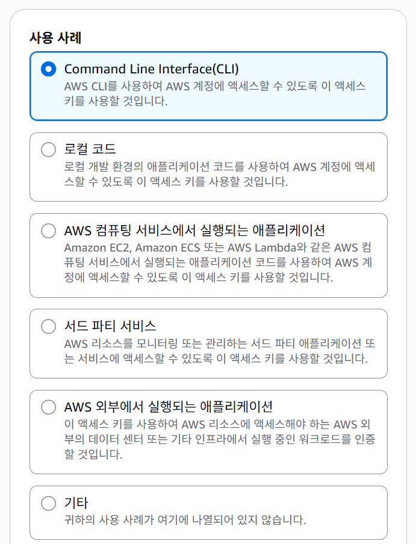

## AWS CLI 기본 사용법

### 1. 설치 여부 확인
```bash
aws --version
````

만약 `command not found` 에러가 뜨면 AWS CLI 설치 필요!

**Mac**

```bash
brew install awscli
```

**Linux**

```bash
sudo apt-get update
sudo apt-get install awscli -y
```

**Windows (Powershell)**
[AWS CLI 설치 가이드](https://docs.aws.amazon.com/cli/latest/userguide/getting-started-install.html) 참고

---

### 2. 자격 증명 설정

현재 설정 확인:

```bash
aws configure list
```

출력 예시:

```
      Name                    Value             Type    Location
      ----                    -----             ----    --------
   profile                  <not set>             None
access_key     ****************ABCD              env
secret_key     ****************XYZ1              env
    region                ap-northeast-2      config
```

초기 설정 방법:

```bash
aws configure
```

순서대로 입력:

```
AWS Access Key ID [None]: (IAM 콘솔에서 발급받은 Access Key)
AWS Secret Access Key [None]: (IAM 콘솔에서 발급받은 Secret Key)
Default region name [None]: ap-northeast-2   # 서울 리전
Default output format [None]: json
```

---

#### Access Key 발급받기

**주의**: 루트 계정이 아닌 **IAM 사용자 계정**을 만들어서 진행하는 것을 권장합니다.

1. IAM 사용자 계정 생성

   * IAM → 사용자(Users) → 사용자 추가(Create user)
   * 사용자 이름 입력 및 체크박스 선택
   * (실습이므로) 관리형 정책 **AdministratorAccess** 부여

   
   
   

2. Access Key 발급

   * 콘솔 → IAM → 사용자(Users) → 생성한 사용자 선택
   * **보안 자격 증명(Security credentials)** 탭에서 Access Key 생성

   
   
   
   

---

### 3. 연결 성공 여부 확인

```bash
aws sts get-caller-identity
```

정상 출력 예시:

```json
{
    "UserId": "AIDAXXXXXXXXXXXXXX",
    "Account": "123456789012",
    "Arn": "arn:aws:iam::123456789012:user/my-iam-user"
}
```
