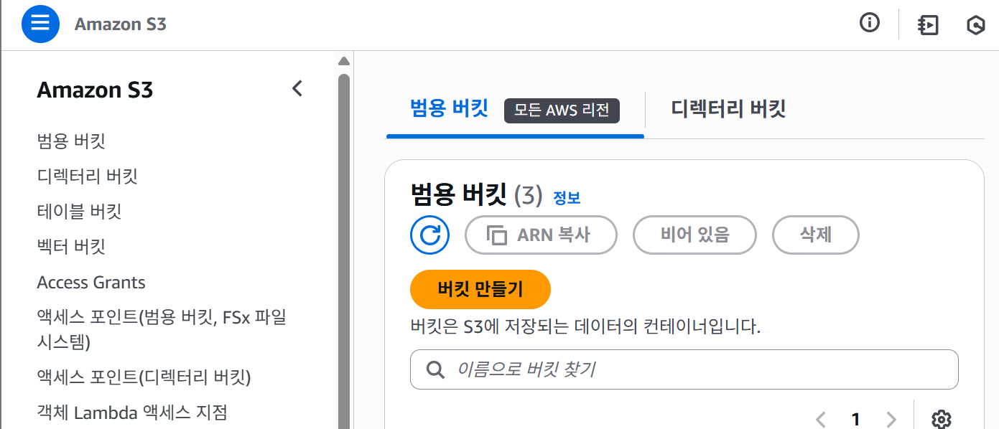
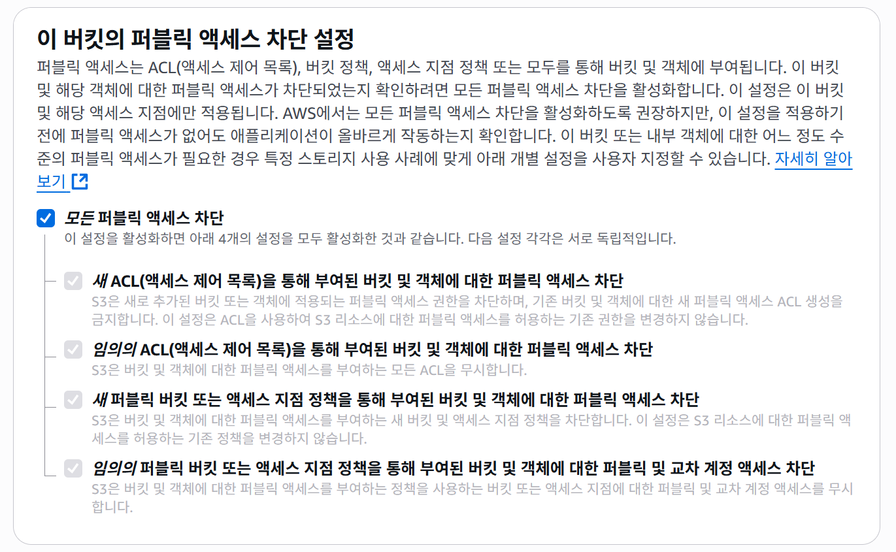

## S3 버킷 생성하기

### AWS 콘솔에서 S3 버킷 생성하기

버킷 이름 생성해주세요!
(참고) https://docs.aws.amazon.com/AmazonS3/latest/userguide/bucketnamingrules.html?icmpid=docs_amazons3_console
버킷은 고유 이름을 가지기 때문에 중복이 불가합니다!

1) [Input 버킷 이름]
2) [Output 버킷 이름]

Presigned URL로 접근하기 때문에 퍼블릭 엑세스는 아래와 같이 설정:


이렇게 두 개 버킷 생성하면 끝.

### AWS CLI에서 S3 버킷 생성하기
```
aws s3 mb s3://[Input 버킷 이름] --region ap-northeast-2

aws s3 mb s3://[Output 버킷 이름] --region ap-northeast-2
```

### 버킷 생성 확인
```
aws s3 ls
```

### 테스트 업로드/다운로드
```
aws s3 cp "./2-s3/test.txt" s3://[BUCKET NAME]/text.txt"
```
확인:
```
aws s3 ls s3://[BUCKET NAME]/
```

```
aws s3 cp s3://[BUCKET NAME]/test.txt "./2-s3/downloaded.txt"
```

### Presigned URL 발급
```
aws s3 presign s3://[BUCKET NAME]/test.txt --expires-in 3600
```