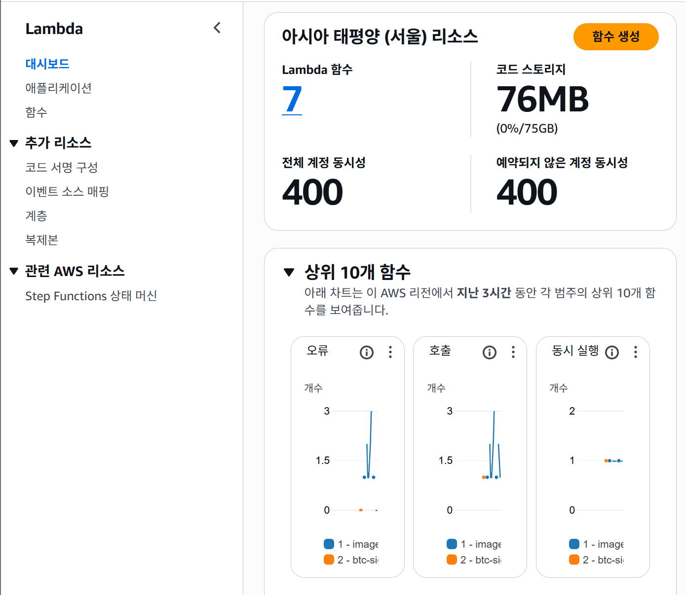
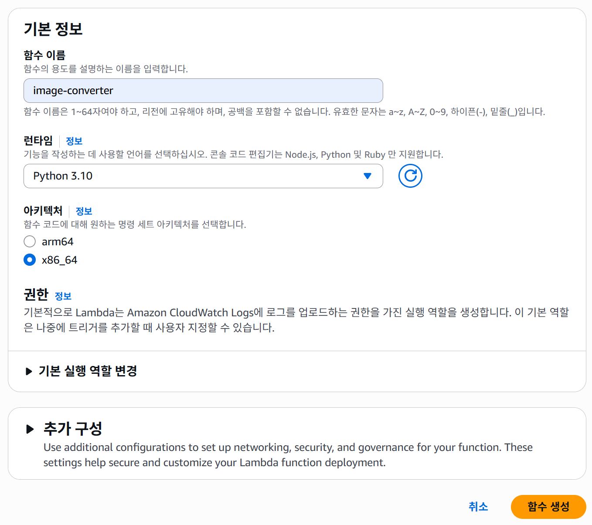
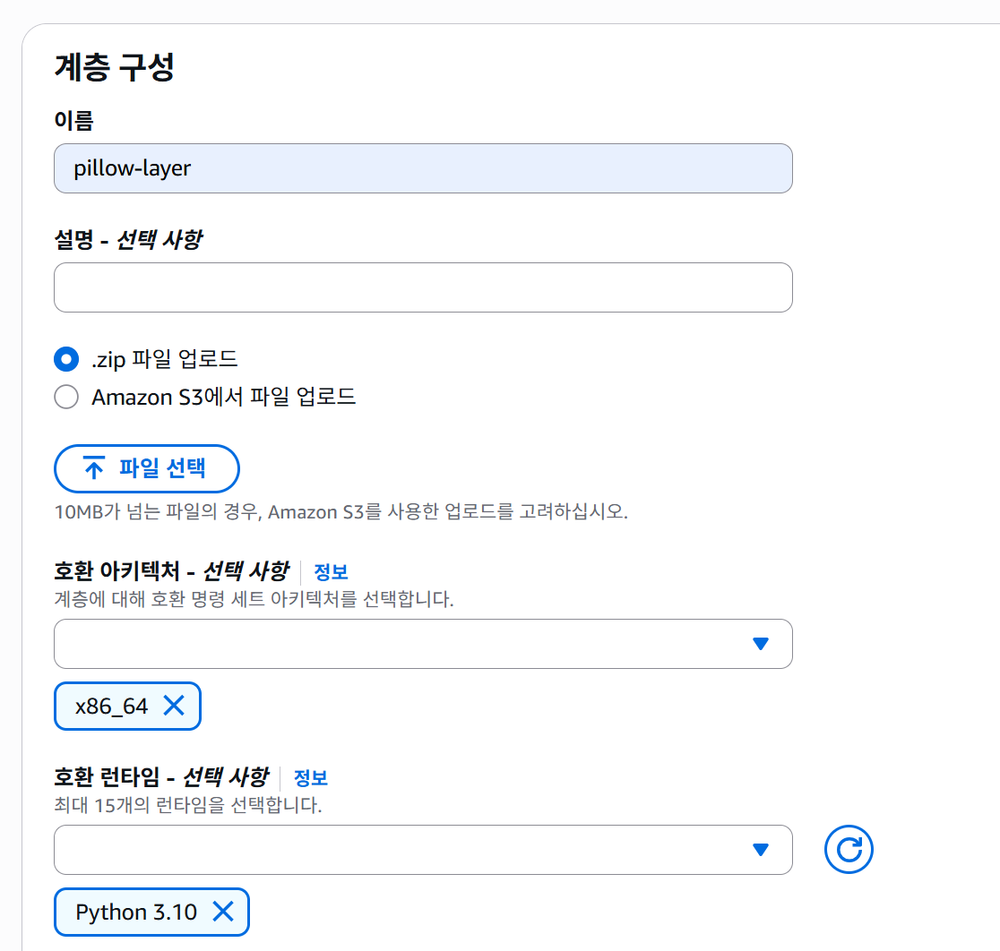

## Lambda 함수 생성하기

1. **함수 만들기(Create function)** 메뉴로 이동  
   

2. **함수 정보 입력** (함수 이름, 런타임 등)  
   

3. 코드 탭에서 `handler.py` 내용을 복사하여 붙여넣기

4. **환경 변수(Environment variables)** 탭에서  
   - `INPUT_BUCKET` = 본인 input S3 버킷 이름  
   - `OUTPUT_BUCKET` = 본인 output S3 버킷 이름  
   입력하기

5. **Deploy** 버튼 클릭

6. 일반 설정(General configuration) 화면 확인  
   

7. 필요 시 구성(Configuration) 편집  
   

8. 필요 라이브러리 layer 생성
   

9. Layer 추가
   

## Lambda 함수 테스트해보기

아래는 **AWS CLI로 Lambda를 직접 호출**해보는 절차입니다.  
입력은 로컬 이미지(`test.jpg`)를 Base64로 인코딩하여 JSON 페이로드에 담아 전송합니다.  
핸들러는 `{"body": "<base64>", "isBase64Encoded": true}` 형식을 기대한다고 가정합니다.

---

### 사전 준비
- AWS CLI 로그인/설정 완료 (`aws sts get-caller-identity`로 확인)
- 테스트용 이미지 파일: `./test.jpg`
- Lambda 함수 이름: `image-converter` (다르면 아래 명령의 함수명만 바꾸세요)

---

### macOS (zsh/bash)

```bash
# 1) Base64 인코딩 (macOS는 줄바꿈 제거 필요)
BASE64_IMG=$(base64 test.jpg | tr -d '\n')

# 2) 페이로드 JSON 생성
printf '{"body":"%s","isBase64Encoded":true}\n' "$BASE64_IMG" > payload.json

# 3) Lambda 호출
aws lambda invoke \
  --function-name image-converter \
  --payload fileb://payload.json \
  --cli-binary-format raw-in-base64-out \
  out.json

# 4) 결과 확인
cat out.json
# 필요 시 jq로 보기 좋게:
# jq . out.json
```

### Linux (bash, GNU base64)
```bash
# 1) Base64 인코딩 (-w0로 줄바꿈 비활성화)
BASE64_IMG=$(base64 -w0 test.jpg)

# 2) 페이로드 JSON 생성
printf '{"body":"%s","isBase64Encoded":true}\n' "$BASE64_IMG" > payload.json

# 3) Lambda 호출
aws lambda invoke \
  --function-name image-converter \
  --payload fileb://payload.json \
  --cli-binary-format raw-in-base64-out \
  out.json

# 4) 결과 확인
cat out.json
# jq . out.json
```

### Powershell
```powershell
# 1) Base64 인코딩 (PowerShell)
$bytes   = [System.IO.File]::ReadAllBytes("test.jpg")
$base64  = [System.Convert]::ToBase64String($bytes)

# 2) 페이로드 JSON 생성
$payload = @{ body = $base64; isBase64Encoded = $true } | ConvertTo-Json -Compress
$payload | Out-File -FilePath payload.json -Encoding ascii

# 3) Lambda 호출
aws lambda invoke `
  --function-name image-converter `
  --payload fileb://payload.json `
  --cli-binary-format raw-in-base64-out `
  out.json

# 4) 결과 확인
Get-Content .\out.json
# (필요 시) 파이프라인으로 보기 좋게:
# Get-Content .\out.json | ConvertFrom-Json | Format-List
```
