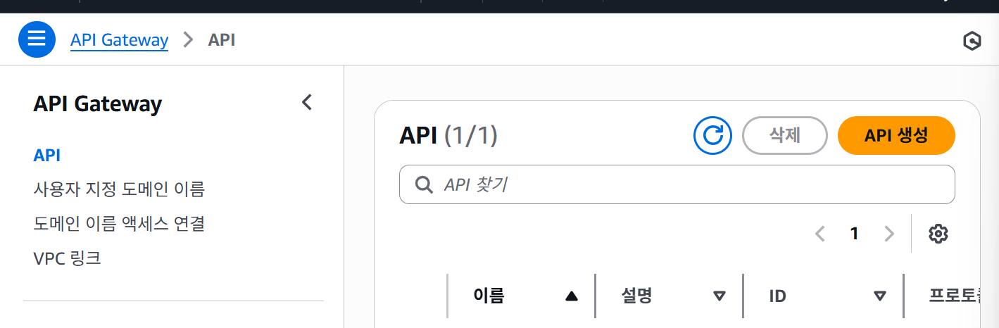
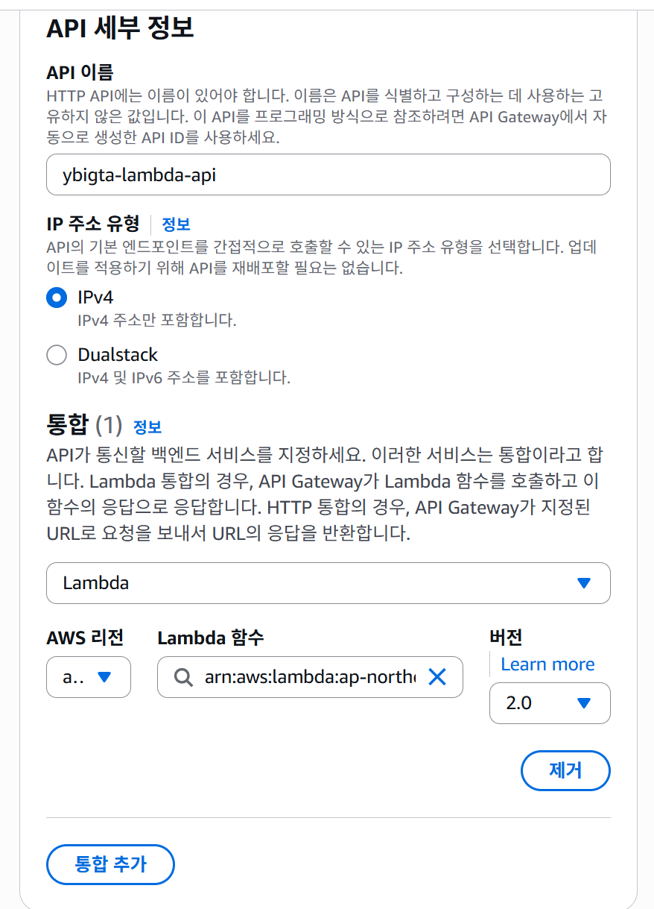
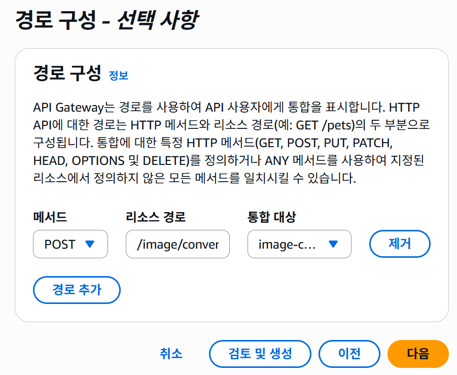

```
cd 3-lambda # test.jpg를 위해!!
```

1. macOS (zsh/bash)
```
# 1) Base64 인코딩 (macOS는 줄바꿈 제거 필수)
BASE64_IMG=$(base64 test.jpg | tr -d '\n')

# 2) base64 문자열을 파일로 저장
printf '%s' "$BASE64_IMG" > img.b64

# 3) API 호출 (Content-Type: text/plain)
curl -i -X POST "https://a63s3c8d3j.execute-api.ap-northeast-2.amazonaws.com/image/convert" \
  -H "Content-Type: text/plain" \
  --data-binary @img.b64
```

2. Linux (bash, GNU base64)
```
# 1) Base64 인코딩 (-w0 옵션으로 줄바꿈 제거)
BASE64_IMG=$(base64 -w0 test.jpg)

# 2) base64 문자열을 파일로 저장
printf '%s' "$BASE64_IMG" > img.b64

# 3) API 호출
curl -i -X POST "https://a63s3c8d3j.execute-api.ap-northeast-2.amazonaws.com/image/convert" \
  -H "Content-Type: text/plain" \
  --data-binary @img.b64
```

3. PowerShell (Windows)
```
# 1) Base64 인코딩
$bytes  = [System.IO.File]::ReadAllBytes("C:\tmp\test.jpg")
$base64 = [System.Convert]::ToBase64String($bytes)

# 2) Base64 문자열을 파일로 저장
$base64 | Out-File -FilePath img.b64 -Encoding ascii

# 3) API 호출
Invoke-RestMethod -Method POST `
  -Uri "https://a63s3c8d3j.execute-api.ap-northeast-2.amazonaws.com/image/convert" `
  -ContentType "text/plain" `
  -InFile "img.b64"
```