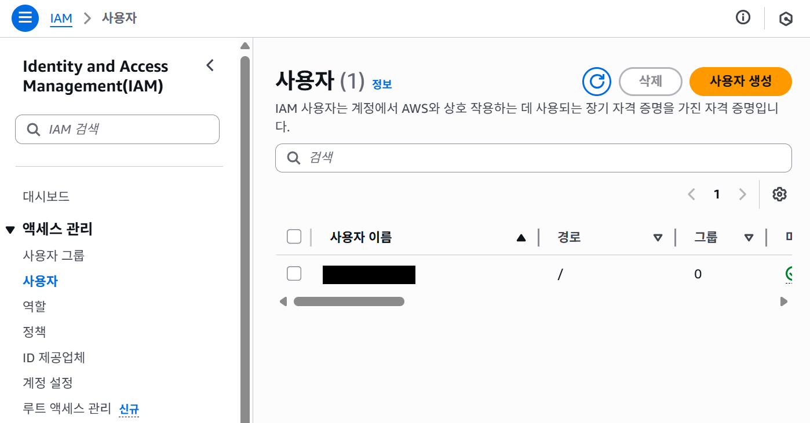

## AWS CLI 기본 사용법

### 1. 설치 여부 확인
```
aws --version
```
만약 `command not found` 에러가 뜨면 AWS CLI 설치 필요!

Mac:
```
brew install awscli
```

Linux:
```
sudo apt-get update
sudo apt-get install awscli -y
```

Powershell:
https://docs.aws.amazon.com/cli/latest/userguide/getting-started-install.html 사이트에서 설치

### 2. 자격 증명 설정
```
aws configure list
```
출력 예시
```
      Name                    Value             Type    Location
      ----                    -----             ----    --------
   profile                  <not set>             None
access_key     ****************ABCD              env
secret_key     ****************XYZ1              env
    region                ap-northeast-2      config
```

초기 설정 방법!
```
aws configure
```
순서대로 입력:
```
AWS Access Key ID [None]: (IAM 콘솔에서 발급받은 Access Key)
AWS Secret Access Key [None]: (IAM 콘솔에서 발급받은 Secret Key)
Default region name [None]: ap-northeast-2   # 서울 리전
Default output format [None]: json
```

#### Access Key 발급받기!

**주의**: 되도록이면 루트 계정이 아닌 IAM 사용자 계정을 만들어서 진행해봅시다.



